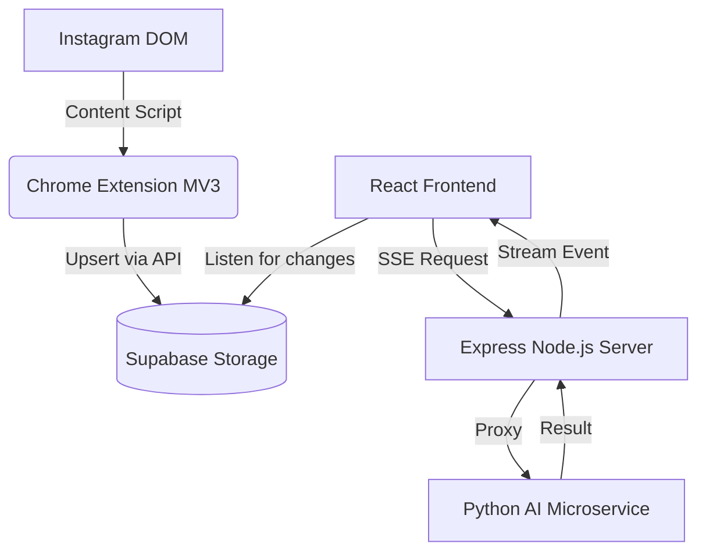

# Sara7a Architecture Blueprint

The Sara7a ecosystem is built on a highly modular, decoupled architecture consisting of a Chrome Extension data scraper, an intermediate Express API, an AI Microservice running multi-modal models, and a progressive React frontend.

## 1. Data Flow

1. **Extraction**: The Chrome Extension parses the browser-rendered DOM, side-stepping Instagram API rate limits and scraping detections.
2. **Caching**: Post data (caption, likes, image URL) is pushed to Supabase.
3. **Trigger**: The React application polls/listens to Supabase. Upon a user clicking "Verify", a Server-Sent Events (SSE) connection is initiated against the Express backend.
4. **Agent Orchestration**: The Express backend delegates requests to the Python Microservice, streaming responses back as individual agents finish.

## 2. Multi-Agent Pipeline (Blue vs. Red)

We employ an adversarial evaluation strategy where two "teams" of deterministic and non-deterministic agents assess the content across three axes: **Content Authenticity**, **Contextual Consistency**, and **Source Credibility**.

### Blue Team (Detection Forensics)
Focuses on intrinsic evidence present in the media and text itself.
- **Image Forensics**: Runs a combined MobileViT + Groq Vision multi-stage pipeline detecting GAN artifacts and manipulation.
- **OCR + Claim Checker**: Utilizes Groq Llama 4 Scout to extract overlaid text and verify if it aligns with the caption's main claims.
- **Link Scanner**: Extracts URLs from captions and leverages Groq Llama 4 Scout for domain reputation and phishing risk analysis.

### Red Team (Context Verification)
Focuses on extrinsic context and history.
- **Reverse Image Search**: Uses Selenium to scrape TinEye (via temporary ImgBB hosting) to find chronological discrepancies (temporal provenance).
- **Caption-Image Alignment**: Uses Groq Vision to measure the semantic distance between the visual events depicted and the caption's description.
- **Bot Pattern Detector**: Extracts account entropy, follower/following ratios, and uses the Serper API to score the likelihood of coordinated inauthentic behavior.
- **Source Credibility**: Leverages Groq Llama 4 Scout to assess linguistic patterns, writing style, and emotional manipulation tactics.

## 3. LLM-Powered Synthesis Agent

The capstone of the architecture is the **Synthesis Agent**.

Instead of simple mathematical averaging, Sara7a forwards the JSON output traces of all 8 agents to a meta-reasoning LLM (Groq Llama 4 Scout). 

### Weighting & Resolution
Agents are assigned reliability weights prior to synthesis:
- **0.20**: Image Forensics (Strongest Media Signal)
- **0.18**: Reverse Image Search
- **0.15**: OCR + Claim Checker
- **0.12**: Caption-Image Alignment
- **0.10**: Text Content & Bot Detection
- **0.08**: Source Credibility
- **0.07**: Link Scanner

**Conflict Resolution Rules provided to the Synthesis Prompt:**
* If Forensics yields >70% confidence of AI generation, it acts as an overriding heavily penalized factor.
* If Reverse Image search identifies a FAKE provenance, the verdict leans highly suspicious, regardless of Text Credibility.
* Context agents (Bot / Credibility) act as multipliers but cannot solely prove falsified content unless corroborated by Blue Team heuristics.

The Synthesis Agent returns:
1. `verdict`: verified, suspicious, or fake
2. `confidence`: Calibrated 0-100 score
3. `synthesis`: A 3-sentence written explanation of the reasoning.
4. `key_evidence`: Top 2-4 points driving the verdict.
5. `contradictions`: Explicit acknowledgment of any agent disagreements.
