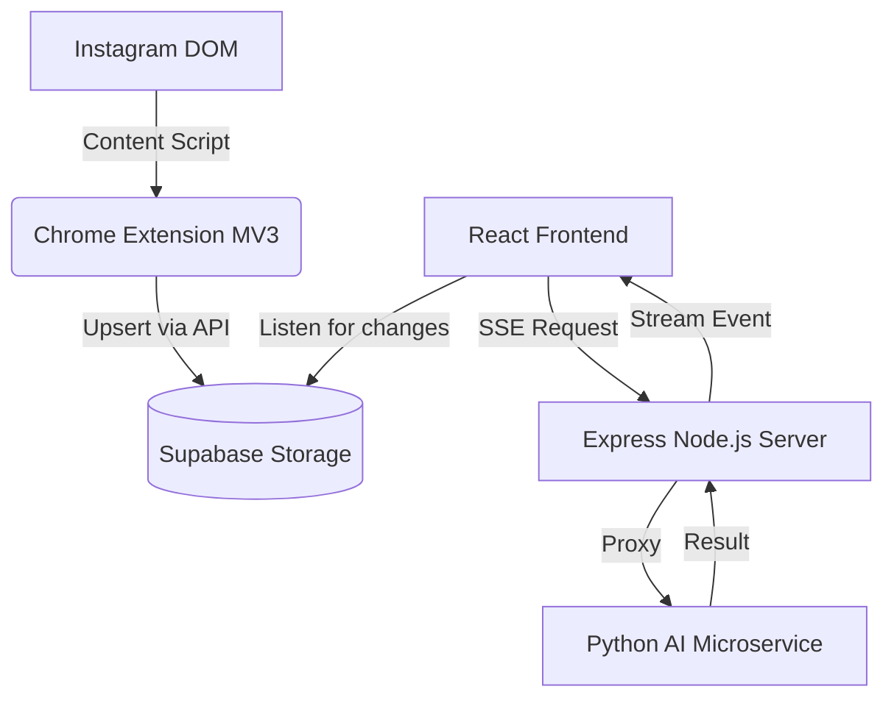
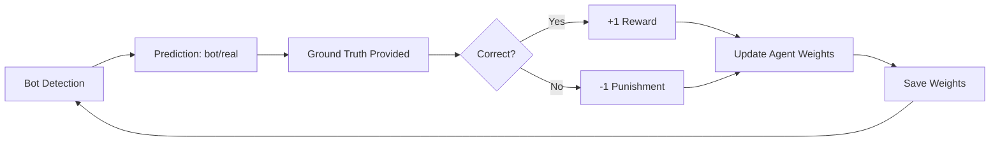

# Sara7a Architecture Blueprint

The Sara7a ecosystem is built on a highly modular, decoupled architecture consisting of a Chrome Extension data scraper, an intermediate Express API, an AI Microservice running multi-modal models, and a progressive React frontend.

## 1. Data Flow



1. **Extraction**: The Chrome Extension parses the browser-rendered DOM, side-stepping Instagram API rate limits and scraping detections.
2. **Caching**: Post data (caption, likes, image URL) is pushed to Supabase.
3. **Trigger**: The React application polls/listens to Supabase. Upon a user clicking "Verify", a Server-Sent Events (SSE) connection is initiated against the Express backend.
4. **Agent Orchestration**: The Express backend delegates requests to the Python Microservice, streaming responses back as individual agents finish.

## 2. Multi-Agent Pipeline (Blue vs. Red)

We employ an adversarial evaluation strategy where two "teams" of deterministic and non-deterministic agents assess the content across three axes: **Content Authenticity**, **Contextual Consistency**, and **Source Credibility**.

### Blue Team (Detection Forensics)
Focuses on intrinsic evidence present in the media and text itself.
- **Image Forensics**: Runs a combined MobileViT + Groq Vision multi-stage pipeline detecting GAN artifacts and manipulation.
- **OCR + Claim Checker**: Utilizes Groq Llama 4 Scout to extract overlaid text and verify if it aligns with the caption's main claims.
- **Link Scanner**: Extracts URLs from captions and leverages Groq Llama 4 Scout for domain reputation and phishing risk analysis.

### Red Team (Context Verification)
Focuses on extrinsic context and history.
- **Reverse Image Search**: Uses Selenium to scrape TinEye (via temporary ImgBB hosting) to find chronological discrepancies (temporal provenance).
- **Caption-Image Alignment**: Uses Groq Vision to measure the semantic distance between the visual events depicted and the caption's description.
- **Bot Pattern Detector**: Extracts account entropy, follower/following ratios, and uses the Serper API to score the likelihood of coordinated inauthentic behavior.
- **Source Credibility**: Leverages Groq Llama 4 Scout to assess linguistic patterns, writing style, and emotional manipulation tactics.

## 3. LLM-Powered Synthesis Agent

The capstone of the architecture is the **Synthesis Agent**.

Instead of simple mathematical averaging, Sara7a forwards the JSON output traces of all 8 agents to a meta-reasoning LLM (Groq Llama 4 Scout). 

### Weighting & Resolution

Agents are assigned reliability weights that are **dynamically adjusted** by the Reinforcement Learning Orchestrator:

**Initial Weights:**
- **0.20**: Image Forensics (Strongest Media Signal)
- **0.18**: Reverse Image Search
- **0.15**: OCR + Claim Checker
- **0.12**: Caption-Image Alignment
- **0.10**: Text Content & Bot Detection
- **0.08**: Source Credibility
- **0.07**: Link Scanner

**Reinforcement Learning:**

The RL Orchestrator continuously improves these weights through feedback:

1. **Prediction**: System classifies account as 'bot' or 'real' based on weighted agent scores
2. **Feedback**: Ground truth is provided (manual review or verified labels)
3. **Reward/Punishment**: 
   - Correct prediction → +1.0 reward
   - Incorrect prediction → -1.0 punishment
4. **Weight Update**: Agents that contributed to correct decisions get increased weights; those that led to errors get decreased weights
5. **Persistence**: Updated weights are saved and used for future predictions

This creates a self-improving system where agent reliability is learned from real-world performance rather than being static.

**Conflict Resolution Rules provided to the Synthesis Prompt:**
* If Forensics yields >70% confidence of AI generation, it acts as an overriding heavily penalized factor.
* If Reverse Image search identifies a FAKE provenance, the verdict leans highly suspicious, regardless of Text Credibility.
* Context agents (Bot / Credibility) act as multipliers but cannot solely prove falsified content unless corroborated by Blue Team heuristics.

The Synthesis Agent returns:
1. `verdict`: verified, suspicious, or fake
2. `confidence`: Calibrated 0-100 score
3. `synthesis`: A 3-sentence written explanation of the reasoning.
4. `key_evidence`: Top 2-4 points driving the verdict.
5. `contradictions`: Explicit acknowledgment of any agent disagreements.

## 4. Reinforcement Learning Orchestrator

Sara7a includes an intelligent RL system that learns from feedback to continuously improve bot detection accuracy.

### Architecture



### Learning Algorithm

The system uses gradient-based weight updates:

```
new_weight = old_weight + (learning_rate × agent_contribution)
```

Where `agent_contribution` is calculated based on:
- Whether the prediction was correct
- How strongly the agent signaled bot/real (OK/WARN/BAD)
- Whether the agent's signal aligned with ground truth

**Example:**
- If prediction was correct and agent signaled 'BAD' for a bot → increase weight
- If prediction was wrong and agent signaled 'BAD' for a real account → decrease weight

### Feedback Loop

1. **Verification**: Bot detection runs with current weights
2. **User Review**: Human provides ground truth label
3. **API Call**: `POST /api/rl-feedback` with ground truth
4. **Weight Update**: RL orchestrator adjusts agent weights
5. **Persistence**: New weights saved to `rl_weights.json`
6. **Next Prediction**: Uses updated weights

### Performance Tracking

The system maintains:
- **Accuracy**: Percentage of correct predictions
- **History**: Last 1000 predictions with outcomes
- **Weight Evolution**: How agent weights change over time

Access via: `GET /api/rl-feedback/stats`

### Benefits

- **Adaptive**: Learns which agents are most reliable for bot detection
- **Self-Improving**: Accuracy increases with more feedback
- **Transparent**: Weight changes are logged and explainable
- **Persistent**: Learned knowledge survives server restarts

