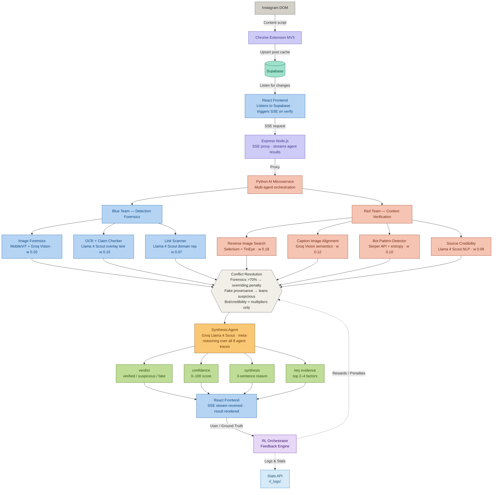

# Verifi (MenaCraft Verification Pipeline)

📺 **[View the Pitch Presentation on Canva](https://canva.link/zflvfy6wwku8z0f)**

An intelligent, multi-agent misinformation detection pipeline designed specifically for verifying Instagram content in real-time. Verifi acts as a robust fact-checking overlay, utilizing an innovative "Red Team vs. Blue Team" architecture orchestrated by a central LLM-driven Synthesis Agent.

## Overview

Verifi reads Instagram posts (via a bespoke Chrome Extension DOM bridge) and automatically streams the content to a Supabase cache. From there, the data is pulled into an 8-agent AI pipeline that checks for image manipulation, claim accuracy, bot-like engagement, and historical reuse. 

By avoiding standard API scraping, it bypasses Instagram's aggressive anti-scraping protections while delivering a seamless, in-browser fact-checking experience.

## Features

- **Red Team / Blue Team Methodology**: Independent agents verify different axes of truth (content authenticity, contextual consistency, source credibility).
- **LLM-Powered Synthesis**: A meta-reasoning agent (powered by Groq Llama 4 Scout) weights the findings from all agents and resolves contradictions to provide a final synthesized verdict.
- **Deepfake & Image Forensics**: Utilizes MobileViT combined with Groq Vision for granular artifact detection.
- **Bot Detection**: Extracts engagement metrics and employs Serper API + rule-based scoring to assign bot probabilities.
- **Temporal Provenance**: Automates reverse image searching via TinEye to detect if an image is being reused out of context.
- **Real-Time Streaming**: Agents stream their individual verdicts progressively directly to the Vite frontend via Server-Sent Events (SSE).

## Architecture Diagram



## Tech Stack

- **Frontend**: React, Vite, Zustand
- **Backend**: Node.js, Express (REST/SSE)
- **AI Microservice**: Python, Flask, Groq Llama 4 Scout, MobileViT
- **Storage**: Supabase (PostgreSQL)

## MobileViT — AI/Real Image Classifier

The deepfake detection agent is powered by a fine-tuned **MobileViT** model trained to distinguish AI-generated images from real ones.

### Dataset

```
📊 Dataset
└── dataset/
    ├── ai/                      AI-generated images  (539 images)
    ├── reel/                    Real images           (436 images)
    ├── train/
    │   ├── ai/                                        (522 images)
    │   └── real/                                      (420 images)
    └── val/
        ├── ai/                                        (198 images)
        └── real/                                      (162 images)
```

### Training Results

The model was trained for **10 epochs** and achieved strong convergence, reaching a final validation accuracy of **98.33%**.

| Epoch | Train Loss | Train Acc (%) | Val Loss | Val Acc (%) |
|-------|-----------|--------------|----------|------------|
| 1     | 0.6178    | 69.53        | 0.4628   | 82.22      |
| 2     | 0.4620    | 78.66        | 0.3676   | 86.67      |
| 3     | 0.3557    | 84.71        | 0.2341   | 94.17      |
| 4     | 0.2769    | 89.70        | 0.1593   | 95.28      |
| 5     | 0.2103    | 91.93        | 0.1428   | 94.72      |
| 6     | 0.1922    | 93.00        | 0.0776   | 97.78      |
| 7     | 0.1595    | 94.16        | 0.0749   | 98.33      |
| 8     | 0.1444    | 94.16        | 0.0653   | 98.33      |
| 9     | 0.1112    | 95.97        | 0.0644   | 98.33      |
| 10    | 0.1154    | 96.07        | 0.0563   | **98.33**  |

**Final model performance:**
- ✅ Validation Accuracy: **98.33%**
- ✅ Validation Loss: **0.0563**
- ✅ Training Accuracy: **96.07%**

The model shows no significant overfitting, with validation loss consistently tracking below training loss throughout all epochs.

## 🧠 Reinforcement Learning System

The RL Orchestrator continuously improves bot detection by learning from feedback. When predictions are correct, agent weights are rewarded. When incorrect, they're adjusted to improve future performance.

### Quick Start

1. **Run Bot Detection**
   ```javascript
   const result = await verifyPostReal(post);
   // Agents like 'Bot Pattern Detector' will evaluate the account
   ```

2. **Provide Ground Truth**
   Instruct the system on real account outcomes:
   ```bash
   curl -X POST http://localhost:3001/api/rl-feedback \
     -H "Content-Type: application/json" \
     -d '{
       "username": "suspicious_account",
       "groundTruth": "bot",
       "botScore": 85,
       "classification": "bot"
     }'
   ```

3. **Check Progress & Logs**
   Monitor real-time accuracy, weight adjustments, and logs:
   ```bash
   curl http://localhost:3001/api/rl-feedback/stats
   curl http://localhost:3001/api/rl-feedback/logs/dates
   ```

### Key Features
- **✅ Self-Improving**: Accuracy increases with continuous feedback.
- **✅ Transparent**: All changes and weight adjustments are logged.
- **✅ Persistent**: Weights (`rl_weights.json`) and logs (`rl_logs/`) survive server restarts.
- **✅ Adaptive**: The system learns exactly which agents are reliable over time.

## Getting Started

### Prerequisites
- Node.js (v18+)
- Python 3.10+
- A Supabase project
- API Keys for Groq, Serper, and ImgBB.

### Installation

1. **Clone the repository:**
   ```bash
   git clone https://github.com/Ghassenboussalem/Menacraft.git
   cd Menacraft
   ```

2. **Backend / Frontend Setup:**
   ```bash
   # Install JS dependencies at the root (concurrently, express, etc.)
   npm install

   # Install Client dependencies
   cd client
   npm install
   cd ..

   # Install Server dependencies
   cd server
   npm install
   cd ..
   ```

3. **Environment Variables:**
   You must set up `.env` files in multiple directories based on the provided `.env.example` templates.
   
   - **Main Server** (`server/.env`):
     ```bash
     cp server/.env.example server/.env
     # Fill in SUPABASE_URL and SUPABASE_ANON_KEY
     ```
   
   - **Python AI Microservice** (`server/python/.env`):
     ```bash
     cp server/python/.env.example server/python/.env
     # Fill in GROQ_API_KEY, SERPER_API_KEY, IMGBB_API_KEY
     ```

4. **Python Dependencies:**
   ```bash
   cd server/python
   pip install -r requirements.txt
   ```

### Running the Project

From the project root directory, run the primary development script:

```bash
npm run dev
```

This will concurrently launch:
1. The Vite React Frontend (`localhost:5173`)
2. The Express Backend (`localhost:3001`)
3. The Python AI Microservice (`localhost:5001`)

Open your browser to `http://localhost:5173` to see the Agent dashboard.

## Contributing

Please refer to `ARCHITECTURE.md` for a detailed breakdown of the interaction between the scraping mechanism, the agent weighting, and the synthesis pipeline.
